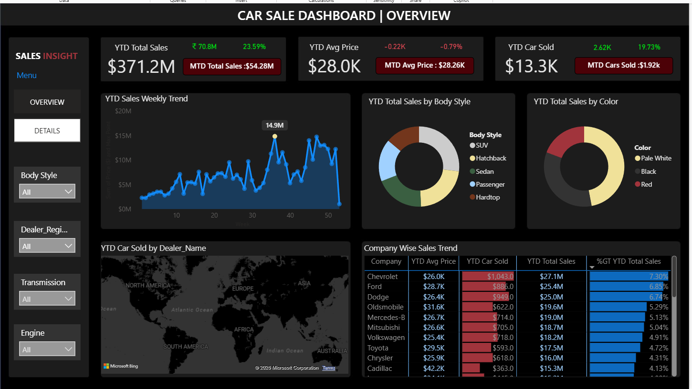

# Car Sales Analysis Dashboard

## Project Overview
This project involves the design and development of a dynamic and interactive Car Sales Dashboard using **Power BI**. The primary goal is to visualize critical Key Performance Indicators (KPIs) to track sales performance over time and enable data-driven decision-making for a car dealership.

## Objectives
- Real-time insights into sales performance metrics.
- Identifying trends and opportunities for growth through Year-over-Year (YOY) and Month-to-Date (MTD) analysis.
- Visualizing sales distribution by region, car body style, and color.

## Data Source
The dataset includes various car models, body styles, colors, sales amounts, dealer regions, and sales dates.
- **File:** `Car Sales.xlsx`
- **Problem Statement:** Outlined in `Problem Statement.docx`

## Key Performance Indicators (KPIs)
The dashboard tracks the following essential metrics:
- **Sales Overview:**
    - **YTD Total Sales:** Year-to-Date total revenue.
    - **MTD Total Sales:** Month-to-Date total revenue.
    - **YOY Growth:** Percentage growth in total sales compared to the previous year.
    - **Difference (YTD vs PTYD):** Variance between current YTD and Previous Year-to-Date sales.
- **Average Price Analysis:**
    - YTD Average Price, MTD Average Price, and YOY Growth in Average Price.
- **Cars Sold Metrics:**
    - YTD Cars Sold, MTD Cars Sold, and YOY Growth in volume.

## Dashboard Features & Visualizations
- **YTD Sales Weekly Trend:** A line chart showing the total sales amount over weeks.
- **Sales by Body Style:** A pie chart illustrating the distribution of sales across different body styles (e.g., SUV, Hatchback, Sedan).
- **Sales by Color:** A pie chart showing the contribution of car colors to total sales.
- **Regional Sales Map:** A map chart showcasing YTD sales data across various dealer regions.
- **Company-Wise Sales Trend:** A tabular grid displaying sales figures for each car manufacturer.
- **Detailed Sales Grid:** A comprehensive table containing all specific sale details for granular analysis.

## Technical Implementation
- **Data Modeling:** Implementation of a dedicated **Calendar Table** to handle time-intelligence functions accurately.
- **DAX Measures:** Created custom measures for YTD, MTD, PTYD, and YOY growth calculations.
- **Power Query:** Used for data cleaning and transformation (e.g., ensuring date formats and regional consistency).

## How to Use
1. Clone this repository.
2. Open the `Car Sales.pbix` file using Power BI Desktop.
3. Ensure the data source path points to the included Excel file if a refresh is needed.
